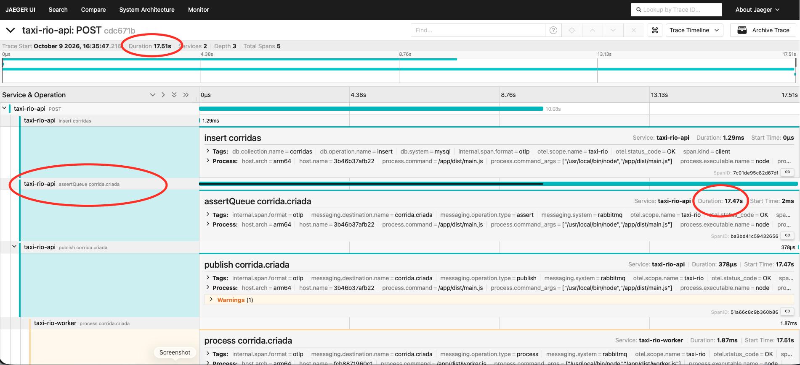
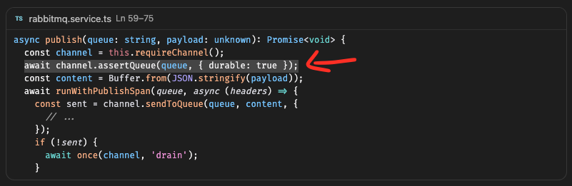
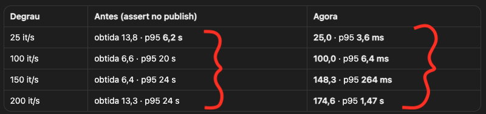
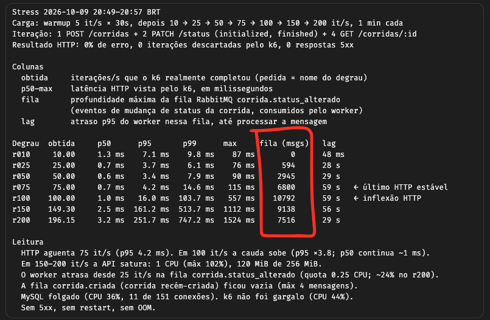
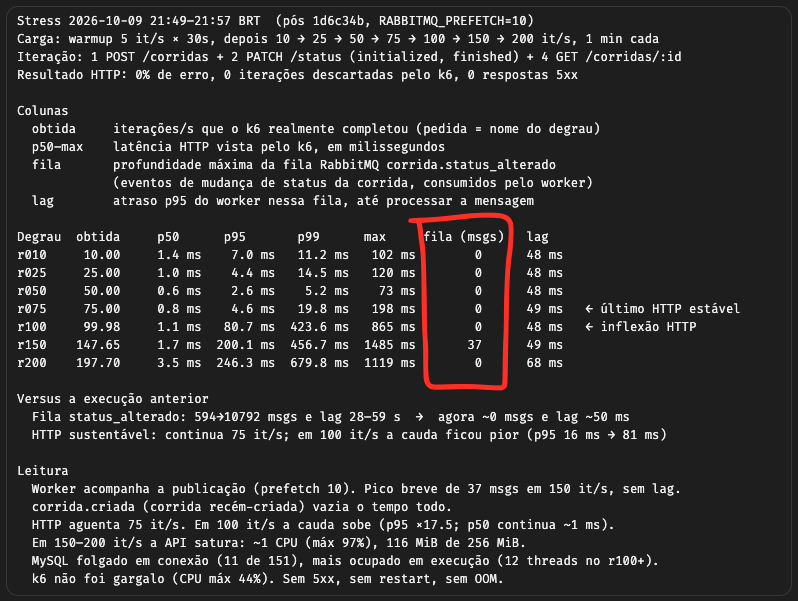

# Relatório do Teste de Carga

**Cenário:** O teste de estresse foi realizado com o k6 em degraus de 1 minuto (10 → 25 → 50 → 75 → 100 → 150 → 200 iterações/s). Cada iteração realiza 1 `POST /corridas`, 2 `PATCH /status` e 4 `GET /corridas/:id`. Os containers operaram com limites fixos de CPU e memória (API com 1 CPU, worker com 0,25 CPU).

O teste revelou dois gargalos independentes. Ambos foram diagnosticados, corrigidos e medidos novamente.

---

## 1. Latência HTTP: `assertQueue` a cada publish

**Sintoma:** As requisições `POST` e `PATCH` apresentaram um p95 na casa dos segundos (chegando a 24 s), enquanto os métodos `GET` respondiam em milissegundos. Como a API estava com cerca de 30% de uso de CPU e as filas permaneciam vazias, conclui que o gargalo era de espera, e não de processamento.

**Diagnóstico:** O trace no Jaeger revelou uma requisição `POST` que durou **17,51 s**, sendo que **17,47 s** desse tempo foram consumidos pelo span `assertQueue corrida.criada`. Em comparação, a inserção no MySQL levou apenas 1,29 ms e a publicação em si, 378 µs.

**Causa:** O código gerado pela IA para o método `publish` executava um `assertQueue` antes de enviar cada mensagem (conforme a linha destacada). Consegui identificar esse comportamento anômalo analisando as métricas e o trace, que evidenciaram uma chamada síncrona ao broker, realizada a cada requisição, apenas para declarar uma fila cuja configuração nunca muda.

**Correção:** A declaração foi removida do fluxo de publicação. Agora, a topologia é declarada apenas uma vez, durante a inicialização da aplicação.

**Resultado:**

| Degrau   | Antes (assertQueue no publish)    | Depois                              |
| -------- | --------------------------------- | ----------------------------------- |
| 25 it/s  | vazão obtida 13,8 · p95 **6,2 s** | vazão obtida 25,0 · p95 **3,6 ms**  |
| 100 it/s | vazão obtida 6,6 · p95 **20 s**   | vazão obtida 100,0 · p95 **6,4 ms** |

Antes da correção, a vazão obtida ficava muito abaixo da esperada, indicando que o sistema não conseguia acompanhar a carga. Após o ajuste, o sistema passou a suportar até 100 it/s, mantendo o p95 em poucos milissegundos.

---

## 2. Fila do worker: prefetch 1 → 10

**Sintoma:** A fila `corrida.status_alterado` começou a acumular mensagens logo a partir de 25 it/s. Em 100 it/s, o acúmulo chegou a **10.792 mensagens**, gerando um atraso (lag p95) de **28 a 59 s** até que o worker conseguisse processá-las.

**Causa:** A implementação inicial feita pela IA deixou o valor de `prefetch` fixado em 1. Ao analisar as métricas de acúmulo de fila e o lag durante os testes, identifiquei que essa configuração era o gargalo. Com o `prefetch` em 1, o broker só envia uma nova mensagem para o worker depois que ele termina de processar a anterior e devolve a confirmação (`ack`). Isso cria um tempo ocioso de rede a cada mensagem, impedindo que o worker processe em sua capacidade máxima.

**Correção:** O prefetch foi tornado configurável através da variável de ambiente `RABBITMQ_PREFETCH`, adotando o valor padrão de 10 por consumidor.

**Resultado:**

| Degrau   | Fila máx. (prefetch 1) | Lag p95 (prefetch 1) | Fila máx. (prefetch 10) | Lag p95 (prefetch 10) |
| -------- | ---------------------- | -------------------- | ----------------------- | --------------------- |
| 50 it/s  | 2.945                  | 29 s                 | **0**                   | **48 ms**             |
| 100 it/s | 10.792                 | 59 s                 | **0**                   | **48 ms**             |
| 200 it/s | 7.516                  | 29 s                 | **0**                   | **68 ms**             |

Com o prefetch configurado para 10, o único acúmulo registrado foi um pequeno pico de 37 mensagens a 150 it/s, o que não gerou impacto perceptível no lag.

---

## Conclusão

| Mudança                          | Métrica                   | Antes       | Depois |
| -------------------------------- | ------------------------- | ----------- | ------ |
| Remover `assertQueue` do publish | p95 de escrita a 100 it/s | 20 s        | 6,4 ms |
| Prefetch 1 → 10                  | Fila máx. a 100 it/s      | 10.792 msgs | 0      |
| Prefetch 1 → 10                  | Lag p95 a 100 it/s        | 59 s        | ~48 ms |

Com a resolução desses dois gargalos, o fator limitante passou a ser o consumo de CPU da API (atingindo ~1 núcleo a partir de 150 it/s).